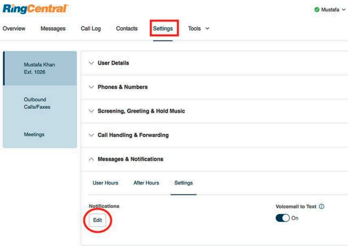
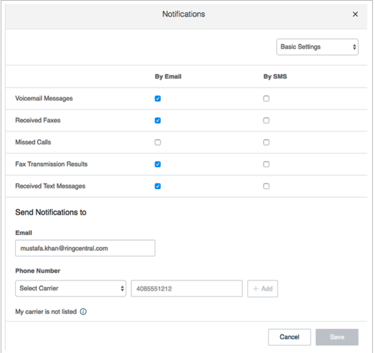
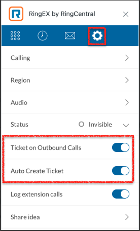
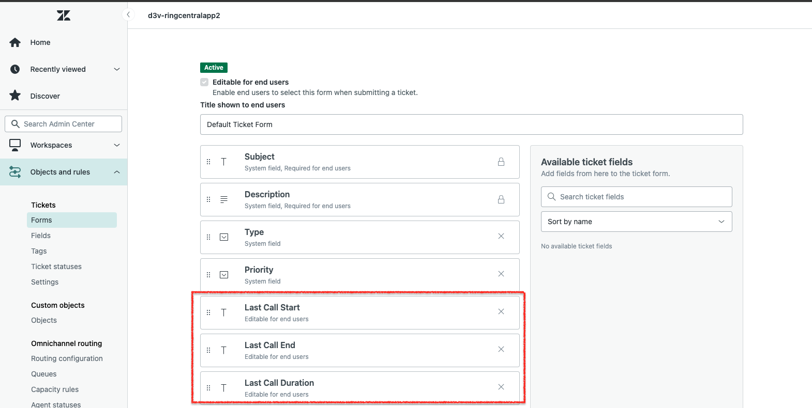

---
hide:
    - toc
---

# General Questions

## Q. I can't see RingCentral for Zendesk when I log in to Zendesk. What is the problem? Does it require some special permission?

A. No, RingCentral for Zendesk does not require any special permissions and should work for all user profiles. Please ask your Zendesk Administrator to ensure that RingCentral for Zendesk is enabled for the Zendesk role you are a member of.

## Q. Can I use the same RingCentral for Zendesk across multiple Zendesk instances?

A. Yes, you can. You will need to contact your Zendesk Administrator to set up and enable the RingCentral Cloud App for Zendesk for each of your instances.

## Q. Can I use the same RingCentral for Zendesk across multiple browsers (e.g., Internet Explorer and Firefox)?

A. Yes, you can use the same RingCentral for Zendesk across as many browsers as you want, provided that the user is not logged into two or more browsers simultaneously. This means that the user cannot be logged into Zendesk on Internet Explorer and Firefox at the same time. Simultaneous logins are not supported.

## Q. When I make a call to my own extension, the incoming call features are not functioning.

A. This behavior is expected. Calls from your own extension to your own extension will not appear in RingCentral for Zendesk.

## Q. I would like to disable this feature for now.

A. To disable this feature, you will need to contact your Zendesk Administrator. Request that they remove your Zendesk user role from RingCentral for Zendesk through the settings.

## Q. Search results are not displaying records that match the caller ID.

A. Check the format of the phone number in Zendesk. Ensure the format is standardized according to Zendesk features.

## Q. On logging into the RingCentral for Zendesk, users are getting this error message: "Your RingCentral edition does not support Zendesk Integration ‒ please call your RingCentral account representative to upgrade your RingCentral edition." What does that mean?

A. Not all RingCentral editions have the ability to use the Zendesk integration. You may have to upgrade your account to be able to
use this feature. Please contact your RingCentral representative for more information.

## Q. It is possible to create Zendesk tickets for all the voicemail messages, missed calls, texts or faxes that you get on your RingCentral phone?

A. Log into your RingCentral account at http://service.ringcentral.com by entering your RingCentral phone number and password. Navigate to Settings and expand the "Messages & Notifications" dropdown menu. Click "Edit" under Settings. (Figure below)

Clicking "Edit" will open a new window displaying Notifications settings.

Select all applicable checkboxes for the features you want to create tickets for. Enter your Zendesk support email address, which should be in the format support@yourcompanyname.zendesk.com.

When a caller leaves a voicemail on your RingCentral phone, an email is sent to the address specified in the settings above. Zendesk then converts this email into a Zendesk Ticket for you. Similar tickets will be created for missed calls, faxes, call recordings, or text messages if you have enabled notifications for those items.

Once you log into Zendesk, you will see these new tickets assigned to the group associated with the email. If the ticket was created with a voicemail, the newly created Zendesk ticket will contain a recording of the voicemail, allowing you to listen to the message left by the caller.

## Q: Tickets are not created for inbound and outbound phone calls made from RingEx by RingCentral in Zendesk

A. Users need to ensure the toggles 'Ticket on Outbound Calls' and 'Auto Create Ticket' are enabled in the integration settings. When these settings are enabled, for inbound calls, a ticket should be created in Zendesk as soon as the user accepts the call. For outbound calls, tickets are created as soon as the user dials the call.

## Q. How do I check the call data inside a ticket created by RingCentral integration?

A. The call data are updated to the RingCentral custom fields: Last Call Start, Last Call End, and Last Call Duration. If users are not seeing these fields in their ticket form, we recommend that a Zendesk admin user navigate to Zendesk Admin Center > Object and Rules > Tickets > Forms. Then, select the form the user has or the default form and add the fields mentioned above. Perform a test call, and the user should see these fields populated.

## Q. Why are the Zendesk tickets created by an agent through RingCentral assigned to the admin user?

A. There are a couple of reasons why Zendesk tickets are assigned to the admin user instead of the agent who made the inbound or outbound call which creates the ticket from RingCentral. We recommend the admin user check the integration console (integrations.ringcentral.com) to find out what kind of authentication type was selected.

-   If the admin selected the 'Default Zendesk rules (Recommended)' option and there are no set triggers and rules set up in Zendesk, then all the tickets created by the agent will be assigned to the admin user who completed this step in the RingCentral integration console. We recommend this option to be selected to automate ticket assignments to adhere to your Zendesk instance's set triggers and rules. Only users with appropriate permissions will receive assigned tickets.
-   If the Zendesk admin selects the 'Admin-based access' option, then it will always be admin-specific ticket assignment. Any agent can create a ticket through RingCentral, but these tickets will be assigned to the admin user.

##Q. The "Ticket on Outbound Calls" option is grayed out, and there is no option to change it. The settings made in the integration console to not create tickets for outbound calls do not work.

A. The toggles "Tickets on Outbound Calls" and "Auto create tickets" will be grayed out for all users, as these configurations are controlled by the admin on the integration console (integrations.ringcentral.com). To enable these settings for all users, we recommend that the admin user disable Activity Sync from the integration console.

Integration Console settings are specific to server-side call logging. This means outbound calls made outside of Zendesk CTI (RingEx by RingCentral in Zendesk) will not create a ticket based on the customer's Integration Console settings.

##Q. Tickets are being incorrectly associated with contacts in Zendesk when making internal calls or calls exchanged between extensions.
A. The issue occurs due to the following logic in the RingCentral for Zendesk integration:

1. Contact Matching Logic: When a call is made to an extension Ex: '209', the system searches for contacts in Zendesk that might match "209".
2. Extension Detection: The system uses a function to detect internal extension calls.
3. Logging Decision: If the "Log extension calls" toggle is enabled, the system will log the call even if it's an internal extension call.
4. Contact Association: The matched contact (if found) gets associated with the call log instead of treating it as an internal extension.

**Recommended Solution:**

-   Disable the "Log extension calls" toggle in the RingCentral for Zendesk widget settings to prevent internal extension calls from being logged to Zendesk contacts.

Why This Solution Works:

-   Prevents False Matching: Disabling this toggle prevents the system from searching for contacts that match extension numbers.
-   Maintains Internal Call Privacy: Internal extension calls remain private and aren't logged to external CRM systems.
-   Preserves External Call Logging: Calls to external numbers will still be logged normally.
-   Eliminates Contact Confusion: No more incorrect contact associations for internal calls.

Additional Recommendations:

-   Review Existing Logs: Check your Zendesk tickets for any incorrectly logged internal calls and clean them up if needed.
-   Train Users: Inform your team about this setting to prevent future confusion.
-   Monitor: After making the change, monitor call logging for a few days to ensure the issue is resolved.
-   If the customer needs to log some internal calls but not others:
-   Consider using different extension ranges for different purposes.
-   Implement call routing rules to distinguish between internal and external calls.
